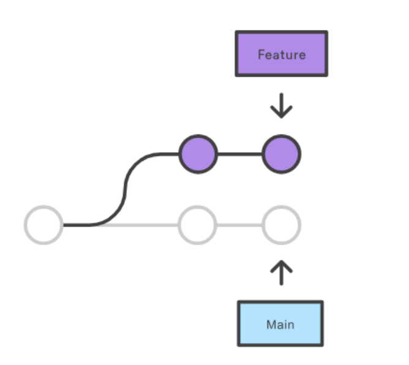
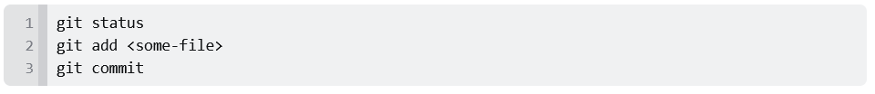
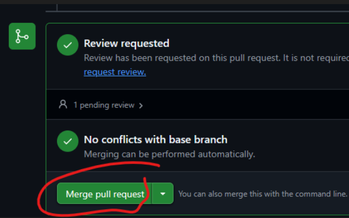

# Branch Strategie - Git Feature Branch Workflow

Das Prinzip des Feature Branch Workflows ist, dass für die Feature-Entwicklung ein neuer Branch erstellt wird und die Entwicklung nicht im main-Branch stattfinden sollte. Somit können mehrere Entwickler an einem bestimmten Feature arbeiten und stören damit nicht die Haupt-Codebasis und der main-Branch enthält dadurch keinen beschädigten Code. Es wird ein zentrales Repository genutzt und main stellt den Verlauf des offiziellen Projekts dar. Für jedes neue Feature wird ein neuer Branch erstellt und es wird nicht direkt auf den lokalen main-Branch commited. Jeder Branch soll einen beschreibenden Namen haben und einem klaren Zweck zugewiesen werden - die Änderungen am Feature-Branch können gestaged, committed und auf das zentrale Repo gepushed werden. Die Feature-Branches können dann von den Teamkollegen im zentralen Repo eingesehen werden. Der offizielle Code bleibt dabei unberührt.

## main-Branch

Mit dem main-Branch beginnt das Projekt und die Feature-Branches werden auf dessen Basis erstellt - das Projekt soll im main-Branch geführt und aktuell gehalten werden. Ein Repository auf GitHub wird erstellt.

## Feature-Branch

Für jedes Feature oder Issue wird ein separater Branch erstellt und auf diesem gearbeitet. Ein neuer Branch wir also erstellt und man checkt lokal auf ihn aus, damit die Änderungen auf diesem Branch stattfinden:

Auf diesem Branch können nun Änderungen vorgenommen und dann gestaged, commited und gepushed werden.

Der Feature Branch wird in das zentrale Repo gepushed. Dies einerseits als Backup und andererseits können so die Teamkollegen den Branch/die Commits sehen. Mit folgendem Befehl wird der neue Branch zum zentralen Repo (origin) gepushed (-u fügt es als Remote-Tracking-Branch hinzu):

Danach kann jeweils git push zum Pushen für diesen Branch verwendet werden.

## Pull Request

Nun wird ein Pull-Request direkt auf GitHub erstellt, damit der Feature-Branch überprüft wird. Die Änderung/das Feature wird nun von einem oder mehreren Teamkollegen überprüft und wenn die Pull-Anfrage genehmigt wurde kann der Feature-Branch in den main-Branch gemerged werden. Es kann sein, dass vor dem Mergen noch Merge-Konflikte gelöst werden müssen, falls Änderungen von einem Teamkollegen am Repo vorgenommen wurden. Der Pull-Request dient der Überprüfung vor dem Merge, also bevor die Änderungen Teil der Haupt-Codebasis werden.

## Merge

Wenn die Pull-Anfrage akzeptiert wurde, kann nun der Feature-Branch in den main-Branch gemerged werden. Auf GitHub kann der Pull-Request überprüft und dann direkt gemerged werden.

